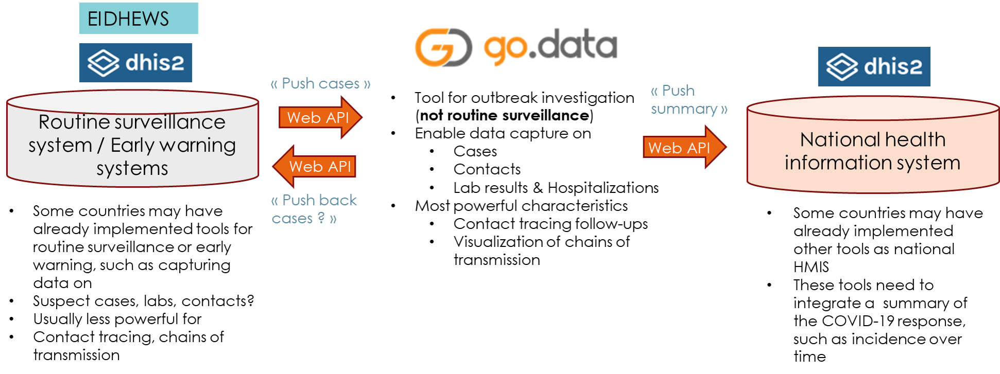

# dhis2-godata-interoperability

Scripts to exchange data between dhis2 and Go.Data instances.



## Requirements

+ Node.js (>= v12.x) and npm (>= v6.x) installed in the system.

## Installation

+ Clone the repository or download it as a zip file.
+ In a terminal, install the dependencies by executing ```npm install``` inside the project folder.
+ Configure the script (more on this below).
+ Compile the scripts by executing ```npm run prepare``` (this will create the *dist* folder with the scripts ready to be executed)

## Actions

The functionallity of the package is splitted among different steps.

+ **node dist/dhis2-godata-interoperability.js copy-metadata**: transfer additional metadata (e.g.: multiple options fields) that is not transfered in the following steps.
  
  

+ **node dist/dhis2-godata-interoperability.js copy-organisation-units \<dest\>**: get all organisation units from DHIS2, transforms them to fit Go.Data's schema and saves them hierarchally in a json file in \<dest\>.
  
  

+ **node dist/dhis2-godata-interoperability.js create-outbreaks**: Create Go.Data outbreaks based on the organisation units and tracked entities of the DHIS2 instance. There are two modes avaliable that can be configured in the configuration file: *GROUP* mode and *EXPAND* mode. *EXPAND* mode create one outbreak for each organisation unit with tracked entities, while *GROUP* mode only creates one outbreak for each group of organisation units under a certain administrative level (that can be configured in the configuration file). *GROUP* mode is the default value with a grouping level of 0 (i.e.: only one outbreak is going to be created in most cases).
  
  

+ **node dist/dhis2-godata-interoperability.js copy-cases**: transfers tracked entities from DHIS2 to Go.Data, transforming the data to fit Go.Data's schema and assigning an outbreak automatically.
  
  

+ **node dist/dhis2-godata-interoperability.js copy-contacts**: transfers contacts from DHIS2 to Go.Data, adding aditional persons and the relationships among them.
  
  

+ **node dist/dhis2-godata-interoperability.js full-transfer**: executes all the steps in order. (*NOTE: the only step that still has to be executed manually is the organisation unit transfer, since the locations have to be imported into Go.Data before the other steps are executed. This is not very convenient and is due to an issue with the creation of locations through Go.Data's API; it is going to be changed in the future as soon as possible*.)
  
  

## Configuration

In order to use the dhis2-godata-interoperability script, a couple of things have to be configured in ./config/config.js, or ./config/config.dev.js for development/testing (some of them are mandatory, like the connection to the APIs, and others have default values that can be used if there's no need for changing them).

+ Connections to APIs: the first think that needs to be configured is the connection to both DHIS2 and Go.Data. A base endpoint has to be provided for each service, as well as the credentials needed for the authentication.

```{js}
// Connection example
module.exports = {
  GoDataAPIConfig: {
    baseURL: 'http://mygodatainstance.com/api',
    credentials: {
      email: 'test@email.com',
      password: '123412341234'
    }
  },
  DHIS2APIConfig: {
    baseURL: 'https://mydhis2instance.com/api',
    credentials: {
      user: 'dhis2user',
      password: '123412341234'
    }
  }
}
```

+ Organisation units root: mandatory configuration of the organisation unit used as the root for the hierarchal structure. (i.e. the ID of the DHIS2 organisation unit with level 1, which means administrative level 0 in Go.Data)

```{js}
module.exports = {
  rootID: 'adkfj2o3i'
}
```

+ Countries: the names of the countries the organisation units represent. In almost all cases this is going to be just one value, but more than one can be provided.

```{js}
module.exports = {
  countries: [ 'Trainingland' ]
}
```

## Testing

```{bash}
npm run test
```
